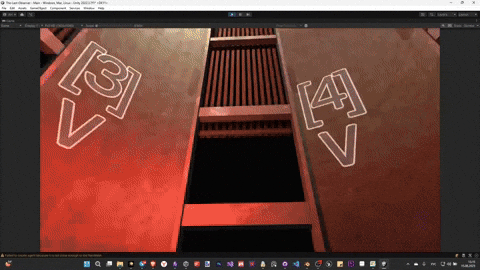

# THE LAST OBSERVER - SHOWCASE

**Experimental survival game about control, pressure and isolation**

This public repository contains a curated selection of scripts and systems that illustrate the core surveillance mechanics of the game.

> *Full Unity project remains private*  
> *This repository is designed as a clean and readable technical showcase*



---

## About the Game

**The Last Observer** places the player in a sealed panopticon room at the center of a multi-floor building. Surrounded by five doors and a failing surveillance system, the player must survive as hostile NPCs move through the environment.

**You cannot move. You can only observe.**

Your only advantage is your ability to control information — monitor camera feeds, map the building layout, and make split-second decisions about which door to close.

---

## Core Systems

### Camera Surveillance System
- Network of 30+ security cameras across multiple floors
- **Grid View** — monitor all cameras simultaneously
- **Detail View** — examine individual feeds with navigation
- **Floor Plan** — annotate blueprints to track camera locations
- Randomized broken cameras for incomplete information each playthrough

### Door Control System
- Five player-controlled doors surrounding the panopticon
- Only **one door can be closed at a time**
- NPCs dynamically choose entry routes

### NPC Navigation
- Unity NavMesh-based pathfinding
- Event-driven behavior (lights out, broken cameras, opened passages)
- Reacts to player surveillance activity

### Phone Events System
- Simulated emergency hotline calls
- Time-sensitive decisions and degrading responses

---

## Technical Highlights

- **Mediator Pattern** for decoupled architecture
- **Event-driven UI** with zero cross-dependencies
- **Optimized rendering** with dual RenderTextures (grid/detail)
- **Session-persistent drawing** on floor plan UI
- **3D interaction system** with highlight feedback

**→ [Full Architecture Documentation](Documentation/Architecture.md)**

---

## Tools & Pipeline

### Material Import Pipeline
Custom Unity Editor tool for automating Blender-to-Unity material workflow:
- Blender addon bakes procedural materials → Albedo, Normal, MRAO maps
- Unity import script auto-configures texture settings and compression
- Naming convention-based material setup

**→ [Blender Addon Repository](https://github.com/khazanovanastasia/blender-addons/tree/main/blender_unity_baker)**

---

## Repository Structure

```
/Scripts
    /Core               # ViewManager, CameraData, InputHandler
    /Camera             # Camera controllers and rendering
    /UI                 # Grid, Detail, FloorPlan UI components
    /Interaction        # 3D object interaction system
    /NPC                # Enemy AI and navigation
    /DoorSystem         # Door control mechanics
    /Events             # Phone and game event systems
    /Editor             # Material import pipeline tool

/Documentation
    Architecture.md     # System design and data flow
    Refactoring.md      # Before/after architecture improvements
    Performance.md      # Optimization strategies

/Media
    /gifs              # Gameplay demonstrations
    /screenshots       # UI mockups and system visualizations
```

---

## Tech Stack

- **Unity 2022.3.62f3** (Built-in)
- **C#**
- **Blender** (3D modeling)
- Custom camera rendering & UI interaction tools

---

## Documentation

- **[Architecture Overview](Documentation/Architecture.md)** — System design, patterns, and component interactions
- **[Refactoring Journey](Documentation/Refactoring.md)** — Before/after architecture improvements
- **[Performance Notes](Documentation/Performance.md)** — Optimization techniques and benchmarks

---

## Development

This project is a **solo development effort** — all modeling, scripting, design and system architecture created by me.

**Status:** Active development  
**Focus:** Clean architecture, performance optimization, and scalable systems

---

## Contact

https://khazanovanastasia.ru/
khasanovanastasia@gmail.com
